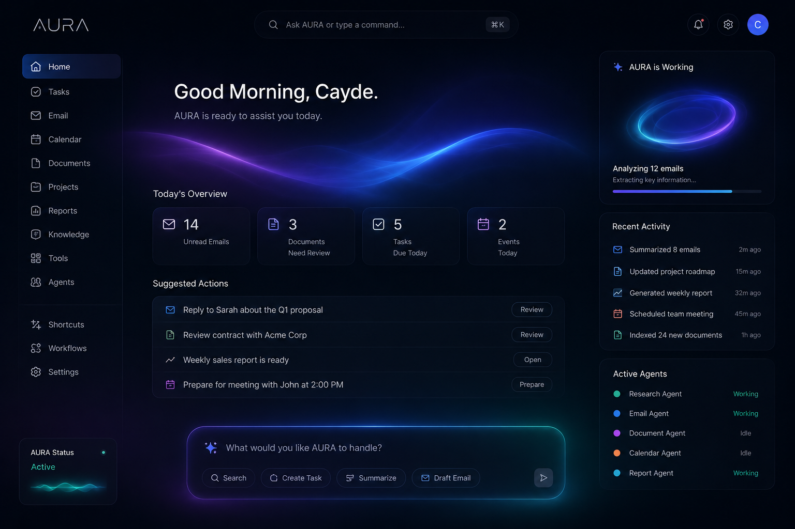

# AURA



> An AI Chief of Staff built to help knowledge workers manage emails, documents, projects, and workflows through intelligent automation.

> **Status:** Early Development (Phase 0 – Planning)

---

## Vision

AURA is not just another chatbot.

It is being designed as an AI Operating System that acts as a proactive Chief of Staff—helping users organize information, automate repetitive work, coordinate specialized AI agents, and make better decisions.

Instead of waiting for commands, AURA's long-term goal is to understand context, prioritize work, and assist users throughout their day while always keeping them in control.

---

## Core Principles

- AI-first, but human-controlled
- Automation with transparency
- Beautiful, premium user experience
- Highly customizable
- Privacy and security by design
- Built to scale

---

## Planned Features

- AI-powered command center
- Multi-agent architecture
- Gmail & Calendar integration
- Document analysis
- Research assistant
- Workflow automation
- Knowledge management (RAG)
- Local and cloud file support
- Custom themes
- User-defined workflows
- Plugin system

---

## Development Roadmap

- [x] Phase 0 — Planning
- [ ] Phase 1 — Foundation
- [ ] Phase 2 — Memory
- [ ] Phase 3 — Agents
- [ ] Phase 4 — Tool Integrations
- [ ] Phase 5 — Workflow Automation
- [ ] Phase 6 — Polish & Deployment

---

## Tech Stack (Planned)

### Frontend

- React
- TypeScript
- Tailwind CSS
- Framer Motion

### Backend

- FastAPI
- Python

### Database

- PostgreSQL
- pgvector

### AI

- OpenAI
- Retrieval-Augmented Generation (RAG)
- Multi-Agent Orchestration

---

## Current Status

AURA is currently in the planning and architecture phase.

The goal is to build the platform professionally from the ground up with a strong emphasis on maintainability, scalability, and user experience.

---

## License

Currently unlicensed.


```
aura
├─ assets
│  ├─ animations
│  ├─ icons
│  ├─ logos
│  ├─ mockups
│  │  └─ aura-dashboard-mockup.png
│  └─ wallpapers
├─ backend
├─ configs
├─ database
├─ docker
├─ docs
│  ├─ architecture.md
│  ├─ decisions.md
│  ├─ ideas.md
│  ├─ principles.md
│  ├─ roadmap.md
│  └─ vision.md
├─ frontend
│  ├─ eslint.config.js
│  ├─ index.html
│  ├─ package-lock.json
│  ├─ package.json
│  ├─ public
│  │  ├─ favicon.svg
│  │  └─ icons.svg
│  ├─ README.md
│  ├─ src
│  │  ├─ app
│  │  ├─ App.tsx
│  │  ├─ components
│  │  │  ├─ common
│  │  │  ├─ presence
│  │  │  │  ├─ AmbientBackground.tsx
│  │  │  │  ├─ AuraWave.tsx
│  │  │  │  ├─ MotionController.tsx
│  │  │  │  ├─ PresenceEngine.tsx
│  │  │  │  ├─ PresenceProvider.tsx
│  │  │  │  ├─ README.md
│  │  │  │  ├─ StartupSequence.tsx
│  │  │  │  ├─ StateGlow.tsx
│  │  │  │  └─ StatusPulse.tsx
│  │  │  ├─ ui
│  │  │  └─ workspace
│  │  ├─ hooks
│  │  ├─ index.css
│  │  ├─ lib
│  │  ├─ main.tsx
│  │  ├─ styles
│  │  │  └─ ambient.css
│  │  ├─ themes
│  │  ├─ types
│  │  └─ utils
│  ├─ tsconfig.app.json
│  ├─ tsconfig.json
│  ├─ tsconfig.node.json
│  └─ vite.config.ts
├─ README.md
└─ scripts

```